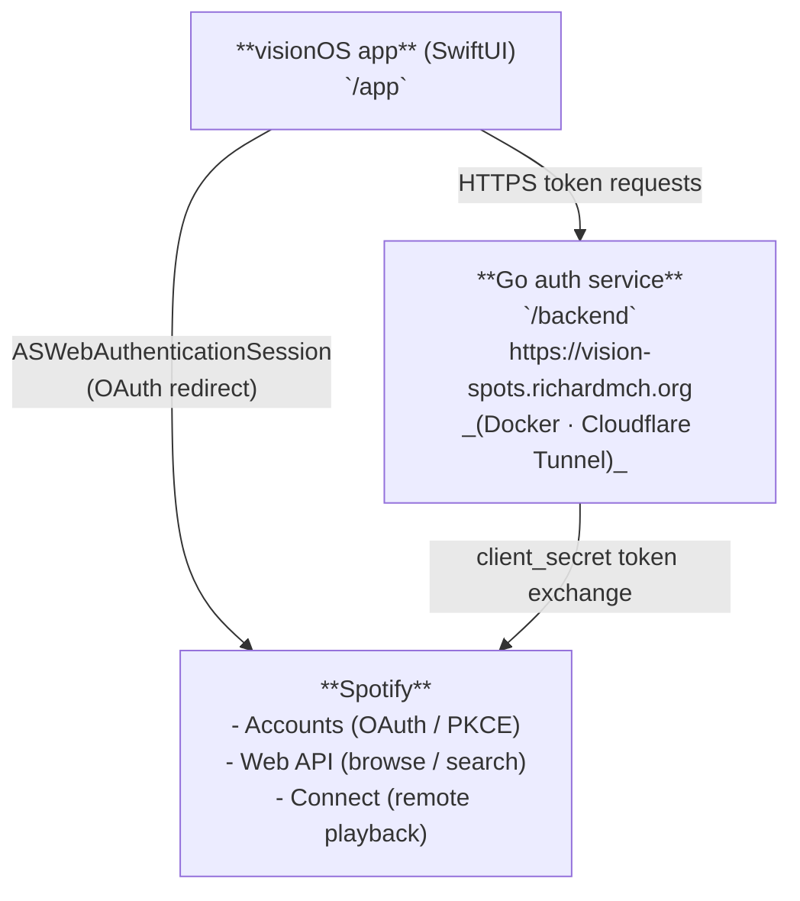

# vision-spots

An open-source **Spotify client for Apple Vision Pro** (visionOS).

Spotify ships no native playback SDK for visionOS, so vision-spots is built in layers:
a native visionOS UI, a small Go auth/token service self-hosted behind
`vision-spots.richardmch.org`, and Spotify's Web API for browsing and **Spotify
Connect** for controlling playback on another device. A research track investigates
whether the iPad-style in-app playback path can be replicated on Vision Pro.

## Architecture

## Repository layout

| Path                     | Owner agent          | Purpose                                            |
| ------------------------ | -------------------- | -------------------------------------------------- |
| `app/`                   | `ui`                 | visionOS SwiftUI Xcode project                     |
| `backend/`               | `backend`            | Go OAuth / token-exchange service                  |
| `docs/agents/`           | —                    | One task file per agent (the work plan)            |
| `docs/contracts/`        | —                    | Shared constants + the app↔backend API contract    |
| `ORCHESTRATION.md`       | —                    | Build order, dependencies, and how agents coordinate |
| `.claude/worktrees/`     | all                  | Per-agent git worktrees (gitignored)               |

## How this project is built

Work is split across a swarm of agents, each with a self-contained task file in
[`docs/agents/`](docs/agents/). Start with **[ORCHESTRATION.md](ORCHESTRATION.md)** —
it defines the order, the shared contracts every agent must honor, and the manual
steps the human owner must perform (Spotify app registration, Apple signing logins).

| Agent                                                          | Phase | Status |
| -------------------------------------------------------------- | :---: | ------ |
| [`backend`](docs/agents/backend.md)                            |   A   | ☐      |
| [`apple-signing`](docs/agents/apple-signing.md)                |   A   | ☐      |
| [`research-playback`](docs/agents/research-playback.md)        |   A   | ☐      |
| [`selfhost-dns`](docs/agents/selfhost-dns.md)                  |   B   | ☐      |
| [`ui`](docs/agents/ui.md)                                      |   B   | ☐      |
| [`spotify-connection`](docs/agents/spotify-connection.md)      |   C   | ☐      |

## License

MIT — see [LICENSE](LICENSE).
